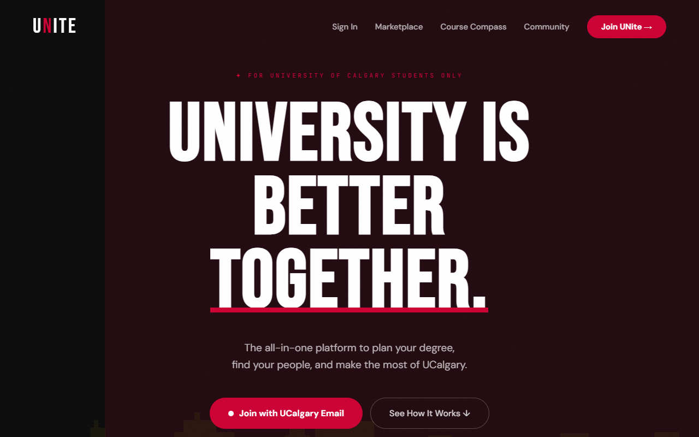
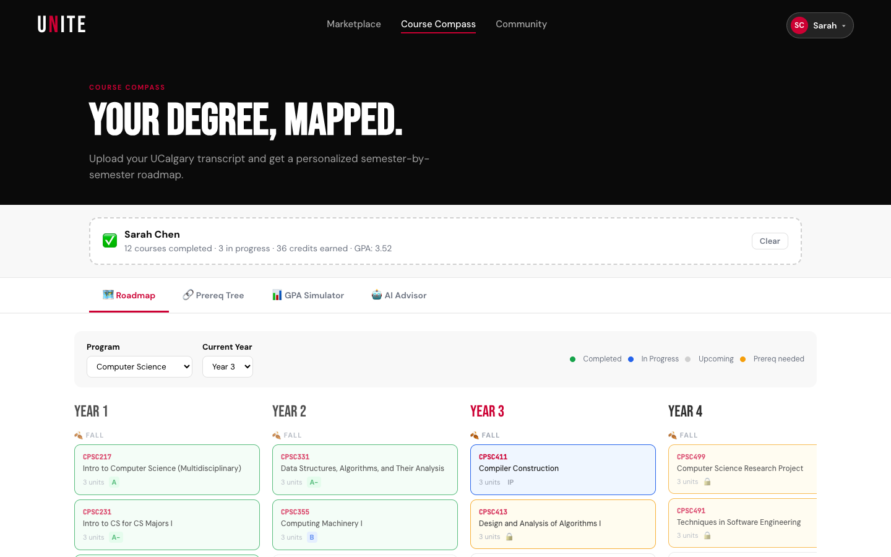
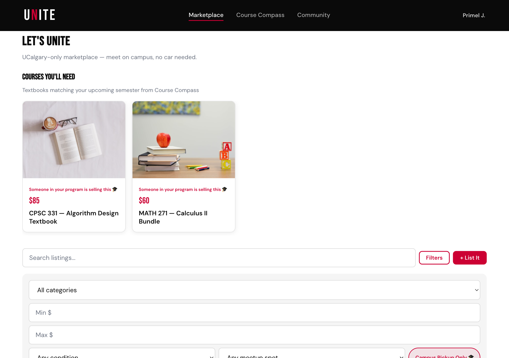
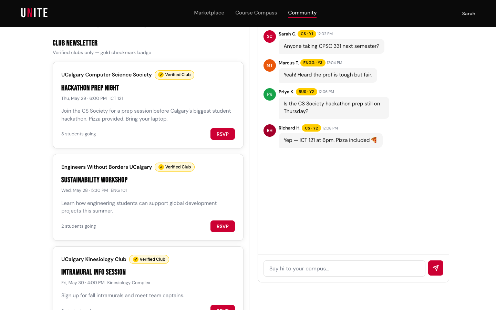
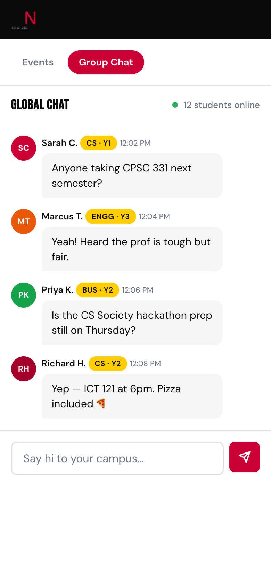

# UNite 🎓

> The all-in-one campus platform for University of Calgary students.  
> Built at Hackathon · May 2026

**Live:** https://unite.up.railway.app

---

## The Problem

University of Calgary has 33,000 students. Most of them:

- Don't have a car — can't buy or sell things without transportation
- Don't know how to find community or events on campus
- Have no clear picture of how their degree maps out over 4 years
- Are scattered across 10 different platforms to find clubs, events, and classmates

## The Solution

UNite is one platform that solves all four problems — verified by UCalgary email, built for the UCalgary campus, and designed to scale to every university in Canada.

---

## Features

### 🧭 Course Compass
AI-powered degree planning built on 5,569 real UCalgary courses. Upload your transcript and get a personalized semester-by-semester roadmap, visualize your prerequisite chain, simulate GPA scenarios with the UCalgary grading scale, and ask an AI advisor anything about your program. Courses you need next semester are automatically surfaced in Marketplace so you can find textbooks.

### 🛒 Marketplace
Buy and sell textbooks, electronics, furniture, and more with fellow UCalgary students. Campus-only meetup spots (MacHall, TFDL, ICT Building, etc.) — no car needed. Click "Let's Unite" to open a direct message thread with the seller and agree on a time and place to meet on campus.

### 🤝 Community Hub
Find events posted by verified UCalgary clubs (gold ✓ badge), sign up for sports and hobby events ("Pull Up" to join a soccer game), and connect in the real-time student group chat. Program data from Course Compass surfaces relevant club events automatically.

### 🔐 UCalgary-Only Authentication
Register and log in with your `@ucalgary.ca` email only. Domain verified on every request. JWT-secured sessions. No UCalgary email — no access.

---

## Tech Stack

| Layer | Technology |
|-------|-----------|
| Frontend | Vanilla JS, HTML5, CSS3 |
| Backend | Node.js, Express |
| Database | PostgreSQL (Railway) |
| AI | Claude API — `claude-sonnet-4-6` |
| Real-time | Pusher |
| Storage | Cloudinary |
| Auth | JWT + UCalgary `@ucalgary.ca` domain verification |
| Deployment | Railway (auto-deploy from `main`) |
| Course Data | 5,569 UCalgary courses pre-processed from Academic Calendar |

---

## How To Run Locally

```bash
git clone https://github.com/saaqibf/unite
cd unite
cp .env.example .env
# Fill in your .env values (see .env.example for required keys)
npm install
npm run dev
```

Open `http://localhost:3000` and sign up with a `@ucalgary.ca` email.

---

## Repository Structure

```
unite/
├── css/                        # Shared design system + page-specific styles
│   └── unite-design-system.css # All CSS variables, components — used by everyone
├── data/
│   ├── ucalgary_courses.json   # 5,569 UCalgary courses with prereqs
│   └── ucalgary_programs.json  # Degree requirements for 5 programs
├── features/                   # Feature pages
│   ├── course-compass.html
│   ├── marketplace.html
│   └── community.html
├── js/                         # Frontend JS modules
├── server/
│   ├── routes/                 # Express API routes
│   ├── middleware/auth.js      # JWT verification
│   └── index.js                # App entry point
├── screenshots/                # 5 judge screenshots
└── reports/                    # Team push reports
```

---

## Screenshots

| | | |
|---|---|---|
|  |  |  |
| Landing | Course Compass | Marketplace |
|  |  | |
| Community Hub | Group Chat | |

---

## Team

| Person | GitHub | Role |
|--------|--------|------|
| Saaqib | [@saaqibf](https://github.com/saaqibf) | Course Compass, Auth, Repo, Deployment |
| Mousa | [@mousamando233-sudo](https://github.com/mousamando233-sudo) | Onboarding, Cross-Feature AI |
| Primel | [@PrimelPJ](https://github.com/PrimelPJ) | Marketplace, Community Hub |
| Richard | [@JKHellNo](https://github.com/JKHellNo) | UI Design System, Landing Page, Chat |

---

## Scaling Vision

UNite starts at UCalgary. The architecture scales to every university in Canada:
- New university → add their email domain + course data JSON → done
- Phase 2: Official Azure AD SSO with each university's IT department
- Phase 3: UNite becomes the student platform for every Canadian university

*This is not a hackathon project. This is a real product with a real roadmap.*

---

*Built at Hackathon · May 23–24, 2026 · University of Calgary*
